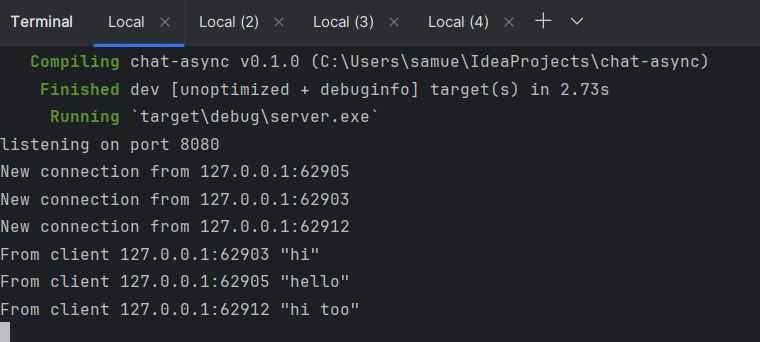
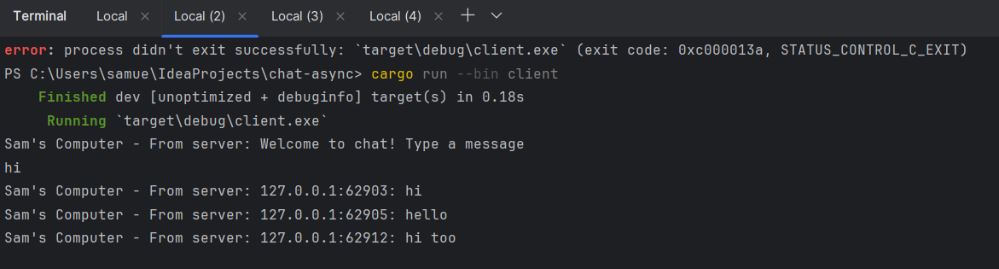
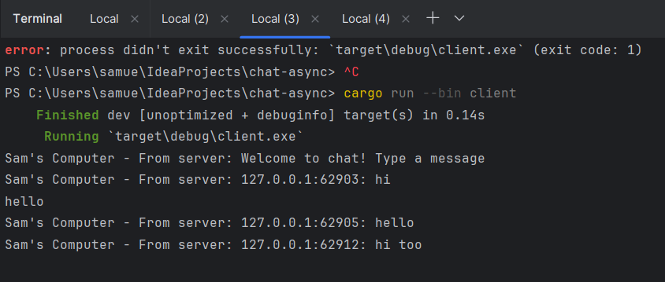
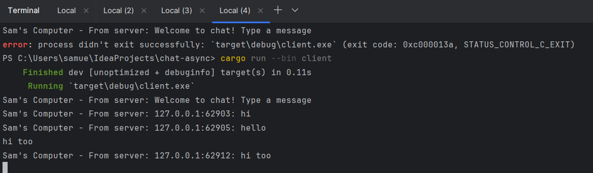

# Chat Async Tutorial 10

Nama: Samuel Taniel Mulyadi

NPM : 2206081805


### **Experiment 2.1: Original code, and how it run**
> 
> 
> 
> 

In one of the exercises, I create a broadcast chat application using Rust. The server and client are implemented using WebSocket communication with the help of tokio_websockets crate.

To start, I'll need to set up a new Cargo project and add necessary dependencies in the Cargo.toml file. Then, I'll create two binaries: one for the server and one for the client. These binaries will be responsible for handling communication between the clients and the server.

In the server code (src/bin/server.rs), I implement the handle_connection function, which manages incoming client connections and broadcasting messages. In the client code (src/bin/client.rs), I'll handle sending user messages to the server and receiving messages from the server.

After completing the implementation, I can run the server and client binaries separately using cargo run --bin server and cargo run --bin client commands respectively.

After running the server and client, i set up two other clients in another two consoles separately. This program acts like a broadcast chat or a global chat, so if I send "hi" as client 1, the server and two other clients will see what i send, which is "hi", same as the two other clients, when they send messages, other can see it.


### **Experiment 2.2: Modifying port**

> 

To modify the port to be 8080. We need to find where we should modify it. Take a look at the other files that need to be modified. 

We need to look at the client.rs and server.rs files respectively and pay our attention to the Websockets.

First in client.rs, we'll easily find websocket, which is shorten as ws

```rust
let (mut ws_stream, _) =
    ClientBuilder::from_uri(Uri::from_static("ws://127.0.0.1:8080"))
    .connect()
    .await?;
```

We change it from 2000 to 8080, then we also change the one in server.rs that listens to the websockets/client

```rust
let listener = TcpListener::bind("127.0.0.1:8080").await?;
```

WebSocket Protocol: Both the server and client use the WebSocket protocol for communication. The WebSocket functionality is provided by the tokio_websockets crate.
Concurrency: Both the server and client use Tokio's asynchronous runtime to handle concurrent tasks. They use the tokio::select! macro to handle multiple asynchronous operations concurrently.


### **Experiment 2.3: Small changes, add IP and Port**

> 
> 
> 
> 

Before this implementation, we didn't have any information on the sender/client of the message. That's why I did some modification on the client.rs and server.rs to see the client's information when they send a message.

In server.rs, the modification is made in this part
```rust
if let Some(text) = msg.as_text() {
println!("From client {addr:?} {text:?}");
let combined = addr.to_string() + ": " + text;
bcast_tx.send(combined.into())?;
```
the reason being is that the original doesn't contain the address of user, adding their address will solve that problem.

In client.rs, the modification is made in this part
```rust
Some(Ok(msg)) => {
                        if let Some(text) = msg.as_text() {
                            println!("Sam's Computer - From server: {}", text);
                        }
                    },
```
It will tell the other clients which are on the server or chat, where the client comes from, since I'm using the same computer, it would be best to change it accordingly to client's computer to have different results, so the addresses will be the main difference here.

After this modification, both the server and client will know each different senders of the messages.
